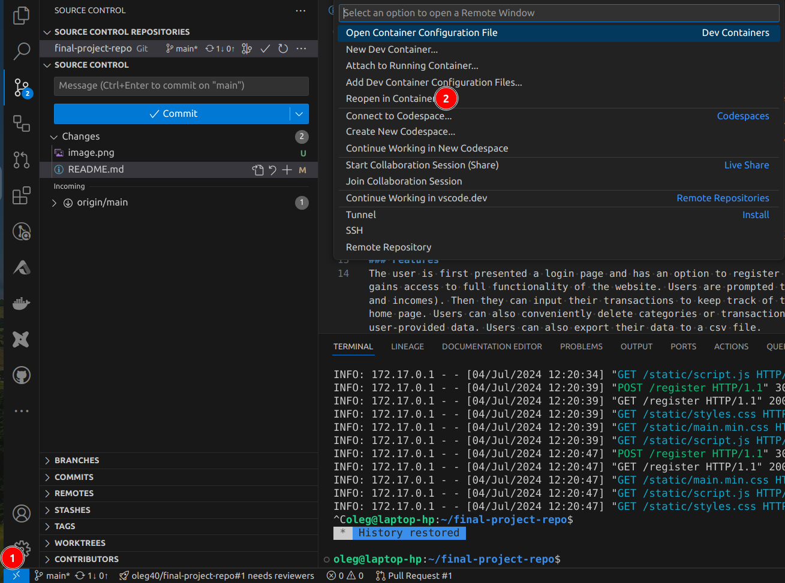

# MONEY MANAGEMENT APP
## Description:
Hi everyone, this is my CS50x final project which is a money management web-app.
It allows users to manage their finances by logging expenses and incomes and analyzing them using this app. The app supports personal accounts feature, so users can log in and out of the website, and all their data is stored on the server. Currently the app supports only one currency. Additional currencies may be implemented in future updates.
The app was built using the following languages: Python, SQL, HTML, CSS, JavaScript, and Jinja. I used Flask to build the web-server and Bootstrap for most of the CSS elements on the website.

## Contribute
- Use Codespaces

- or use VSCode:
    - clone the repo `https://github.com/oleggur/final-project-repo.git` and reopen in container
    

### Features
The user is first presented a login page and has an option to register on the website. Upon registration or login, the user gains access to full functionality of the website. Users are prompted to create categories for their transactions (expenses and incomes). Then they can input their transactions to keep track of them. Users can view all their transactions on the home page. Users can also conveniently delete categories or transactions. The "Stats" page contains tables based on the user-provided data. Users can also export their data to a csv file.

### Structure
In the project root folder are the following files:
- app.py. This Python file contains application logic and does all the calculations for this app. More on the structure of this file later.
- helpers.py is another python file created for helper functions that we can use in our main file, app.py.
- requirements.txt. It lists imports for app.py and helpers.py.
- database.db is an SQLite database that stores data. Users' input is stored in this database, and accessed as needed.

There are also 3 folders inside the root folder:
- static. This folder is required by Flask and contains static content such as CSS stylesheets, JavaScript scripts, and icons.
- templates. Also a standard Flask requirement. Contains HTML files. More on the content of those files later.
- flask_session. Automatically generated by the flask_session library.
- export. Stores export files to be sent to users. Files are sent immediately upon user's request. Each user has his own folder within export. This folder is deleted once the user deletes their account.

#### app.py
First we initialize and configure our app to store user session data on the server's filesystem and set the session cookie to be deleted when the user closes the browser. Then we configure our app to use an SQLite database using CS50's library (SQL). The rest of the file contains routes - functions that define the behavior of each web-page. Note that most of the routes have the `@login_required` decorator. It means that if a user has not logged in yet but is trying to view a page that requires the user to be logged in - the app does not load that page and instead redirects the user to the login page. User's input is sent to the server via POST and GET requests. app.py also determines which data to send to the HTML pages to show to the user.

#### database.db
The database has 3 tables: Users, Categories, and Transactions which speak for themselves. We access data in the database by executing SQL queries using CS50's SQL library. Returned is a list of dictionaries that we can extract necessary data from.

#### static folder
The two notable files here are static.css and script.js. Styles.css contains css code that I've used aside from Bootstrap css. Script.js is for JavaScript functions. I did not use much JavaScript as most data is processed at the back-end with python, not in the user's browser.

#### templates folder
Contains actual HTML pages to render to the user. All of them use the Jinja templating language. Notably, "layout.html" provides the default layout of all the pages of the website. Other html files only have new data that we want to build on top of what is rendered by "layout.html".
